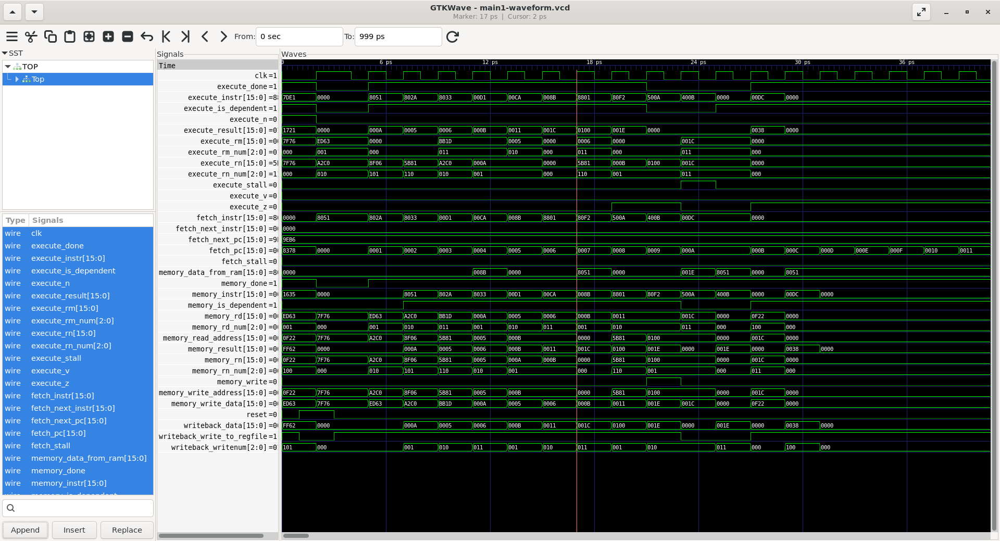
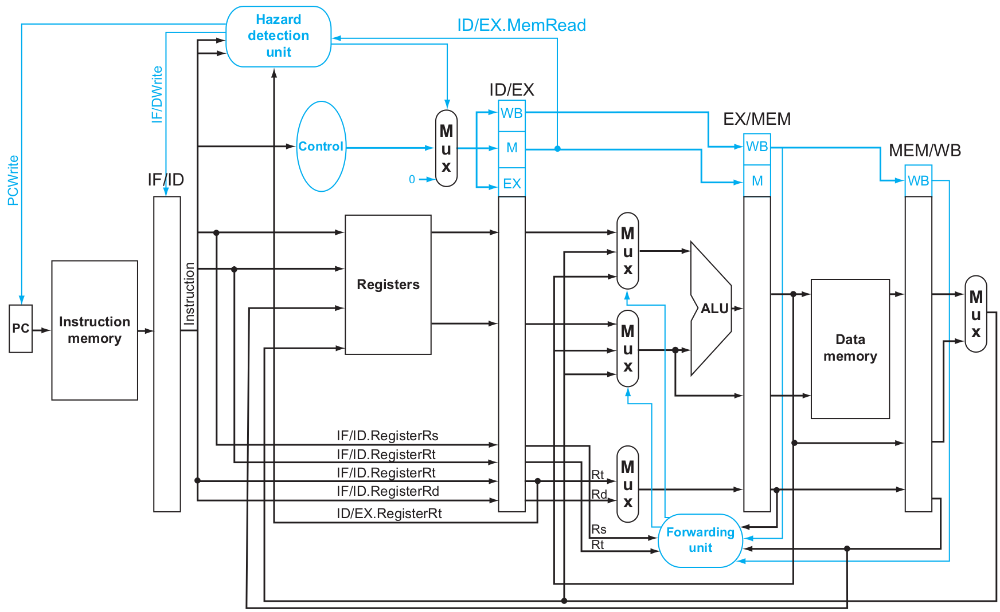

# The TSP16 CPU/ISA 



The TSP16 (Tiny Simple Processor 16 Bit) is a custom ISA I have created. This is a five stage piepline CPU and could you find the entire under the `rtl` directory. The pipeline is heavily inspired by both ARM and MIPS. Read more below if you are interested


Here is the entire ISA: 


## Project Structure 

```
rtl/ – Verilog source files for the CPU design.
testbench/ – Testbenches and simulation scripts.
docs/ – Images for the README file
Makefile – Build automation script.
```

## Computer Architecutre / Pipelining



To enhance performance, the CPU employs data forwarding (bypassing). At the rising edge of each clock cycle, data is forwarded from later pipeline stages to earlier ones when needed, reducing pipeline stalls and improving instruction throughput.

### Pipeline Characteristics

Here are the pipeline stages:

1. Instruction Fetch (IF)
2. Execute (EX)
3. Memory Access (MEM)
4. Write Back (WB)

If you notices closely, you would see that this CPU doesn't have a instruction decode stage. This is simply because the instruction set I created is so simple to parse that it 
doesn't need a decode stage. The one more clock cycle stalling from branch prediction out weights this benefit.

## Prerequisites

You would need to install the following, it is proven to work with the following versions: 

1. Verilator 5.020 2024-01-01 rev (Debian 5.020-1)   
2. gcc (Ubuntu 13.3.0-6ubuntu2~24.04) 13.3.0     

## Build
To build this project, you will need verilator. Assuming you have that, you can run the test by typing the following command

```
git clone https://github.com/Mr-Anyone/TSP16-CPU.git
cd TSP16-CPU
make -j test
```