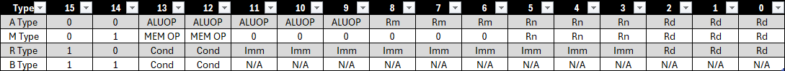

# The TSP16 CPU/ISA 

The TSP16 (Tiny Simple Processor 16 Bit) is a custom ISA I have created. This is a five stage piepline CPU and could you find the entire under the `rtl` directory. 

It supports the following instructions:



## Computer Architecutre / Pipelining


This entire CPU is heavly inspired by the MIPS microarchitecture architecture which is the image from above. 
SO the microarchitecture of this CPU is really similar to the one above. 

## Build 

To build this project, you will need verilator. Assuming you have that, you can run the test by typing the following command

```
git clone https://github.com/Mr-Anyone/TSP16-CPU.git
make -j test
```